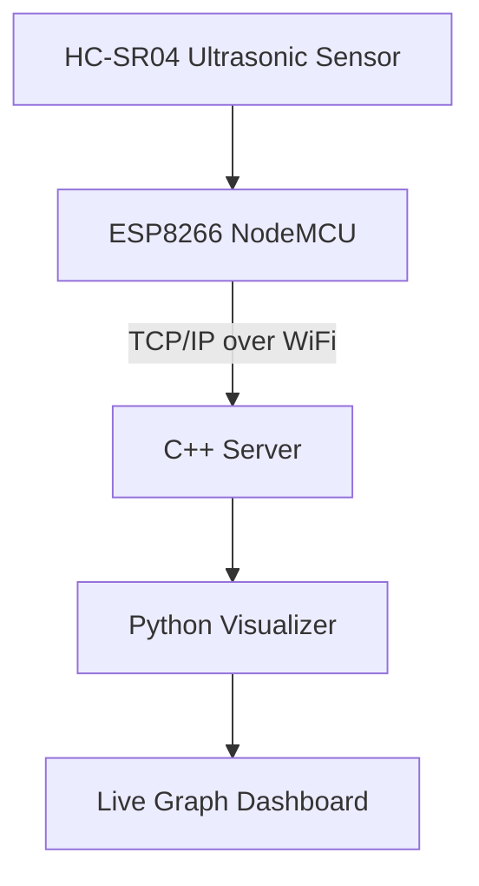
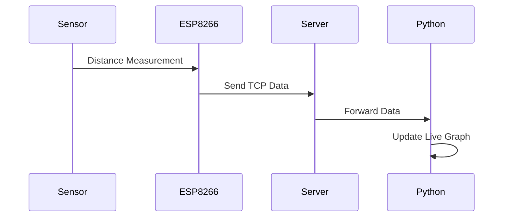

<div align="center">

#  Smart Distance Monitoring System over TCP/IP

### IoT-based real-time distance monitoring using ESP8266, HC-SR04, C++ sockets, and Python visualization

<p>
  
  
  
  
  
  
</p>

</div>

---

##  Overview

The **Smart Distance Monitoring System over TCP/IP** is an IoT-based embedded project that measures object distance using an **HC-SR04 ultrasonic sensor** and transmits sensor data wirelessly over **TCP/IP** using an **ESP8266 NodeMCU**.

The received data is processed by a **C++ server** and visualized dynamically through a **Python real-time graphing application**.

This project demonstrates an end-to-end IoT workflow involving:

- Embedded hardware interfacing  
- Wireless networking  
- Socket programming  
- Real-time visualization  

---

##  Objectives

- Measure distance using ultrasonic sensing  
- Transmit readings over WiFi using TCP/IP  
- Receive data through a C++ socket server  
- Visualize live readings with Python  
- Demonstrate complete IoT data pipeline  

---

#  System Architecture

## Block Diagram



---

## Data Flow



---

##  Technologies Used

| Layer | Technology |
|---|---|
| Embedded Controller | ESP8266 NodeMCU |
| Sensor | HC-SR04 |
| Communication | TCP/IP over WiFi |
| Backend Server | C++ Socket Programming |
| Visualization | Python + Matplotlib |

---

#  Hardware Requirements

- ESP8266 NodeMCU  
- HC-SR04 Ultrasonic Sensor  
- Breadboard  
- Jumper wires  
- 2 Resistors (Voltage Divider for Echo pin)

---

## Circuit Connections

| HC-SR04 | ESP8266 |
|---|---|
| VCC | Vin (5V) |
| GND | GND |
| Trig | D1 |
| Echo | D2 *(via voltage divider)* |

 **Important:**  
HC-SR04 Echo outputs **5V**, while ESP8266 GPIO supports only **3.3V**.

Use voltage divider:

```text
Echo ---- 1kΩ ---- GPIO
          |
         2kΩ
          |
         GND
```

---

#  Project Structure

```bash
smart-distance-monitoring-tcp-ip/
│
├── README.md
├── LICENSE
├── .gitignore
│
├── esp8266_client/
│   └── esp8266_client.ino
│
├── server_cpp/
│   ├── server.cpp
│   └── Makefile
│
├── python_visualizer/
│   └── visualizer.py
│
└── docs/
    ├── architecture.png
    └── flow_diagram.md
```

---

#  Setup & Installation

## 1️ ESP8266 Setup

Install:
- Arduino IDE
- ESP8266 Board Package

Update WiFi configuration:

```cpp
const char* ssid = "YOUR_WIFI";
const char* password = "YOUR_PASSWORD";
const char* serverIP = "YOUR_PC_IP";
```

Upload code to ESP8266.

---

## 2️ Run C++ Server

```bash
cd server_cpp
make
./server
```

---

## 3️ Run Python Visualizer

Install dependencies:

```bash
pip install matplotlib
```

Run:

```bash
python visualizer.py
```

---

#  Communication Format

Distance data is transmitted as plain text:

```text
<distance_in_cm>
```

Example:

```text
42
```

---

#  Features

 Real-time distance sensing  
 Wireless communication via WiFi  
 TCP/IP socket programming  
 Live graph updates  
 Modular architecture  
 Easy hardware integration  

---

# 📊 Example Output

Terminal:

```bash
Distance: 35 cm
Distance: 36 cm
Distance: 34 cm
```

Graph:
- Continuous live updates  
- Dynamic plotting of distance values  

---

#  Troubleshooting

## ESP8266 Not Connecting
- Check SSID/password  
- Verify same WiFi network  

## No Server Data
- Verify server IP  
- Check firewall settings  

## Distance Always Zero
- Check sensor wiring  
- Ensure proper delays between readings  

---

#  Future Enhancements

- Web dashboard using Flask/React  
- MQTT protocol support  
- Cloud integration (AWS/Firebase)  
- Database logging  
- Mobile app monitoring  

---

#  Learning Outcomes

This project demonstrates:

- Embedded systems programming  
- Sensor interfacing  
- WiFi networking  
- TCP/IP communication  
- Socket programming  
- Real-time visualization  

---

#  Author

**Your Name**  
Embedded Systems & IoT Developer

---

#  Contribution

Contributions are welcome.

```bash
Fork → Clone → Improve → Pull Request
```

---

#  Acknowledgment

Built as a practical IoT implementation combining hardware and software integration.

---

<div align="center">

### ⭐ If you found this useful, consider starring the repository ⭐

</div>
````


